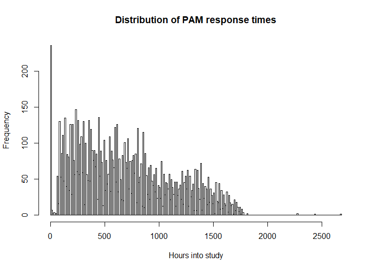

studentlife: Seamless tidy handling and navigation of a rich mHealth dataset from Dartmouth
======================================================================================================

Install from GitHub with
------------------------

``` r
# install.packages("devtools")
devtools::install_github("frycast/studentlife")
```

Details on the dataset are available [here](https://studentlife.cs.dartmouth.edu). Once installed, you can download and extract the data within R:

``` r
d <- "studentlife"
library(studentlife)
download_studentlife(dest = d)
```

Then you can use the interactive menu to browse the tables and schemas:

``` r
tab <- studentlife::load_SL_tibble(location = d)
```

Restrictions can be placed on the menu options with `time_options`:

``` r
tab_t <- load_SL_tibble(location = d, time_options = "timestamp", csv_nrows = 10)
tab_p <- load_SL_tibble(location = d, time_options = "interval" , csv_nrows = 10)
tab_d <- load_SL_tibble(location = d, time_options = "dateonly" , csv_nrows = 10)
tab_s <- load_SL_tibble(location = d, time_options = "dateless" , csv_nrows = 10)
```

The `regularise_time` function can be used to summarise information within blocks of time:

``` r
tab <- load_SL_tibble(
  loc = d, schema = "sensing", table = "activity", csv_nrows = 10)
  
regularise_time(
  tab, blocks = c("day","weekday"),
  act_inf = max(activity_inference), add_NAs = FALSE)
```

Produce a histogram showing PAM EMA response frequencies over the course of the study:

``` r
tab_PAM <- load_SL_tibble(schema = "EMA", table = "PAM", location = d)
response_hour_hist(tab_PAM, break_hours = 10)
```


